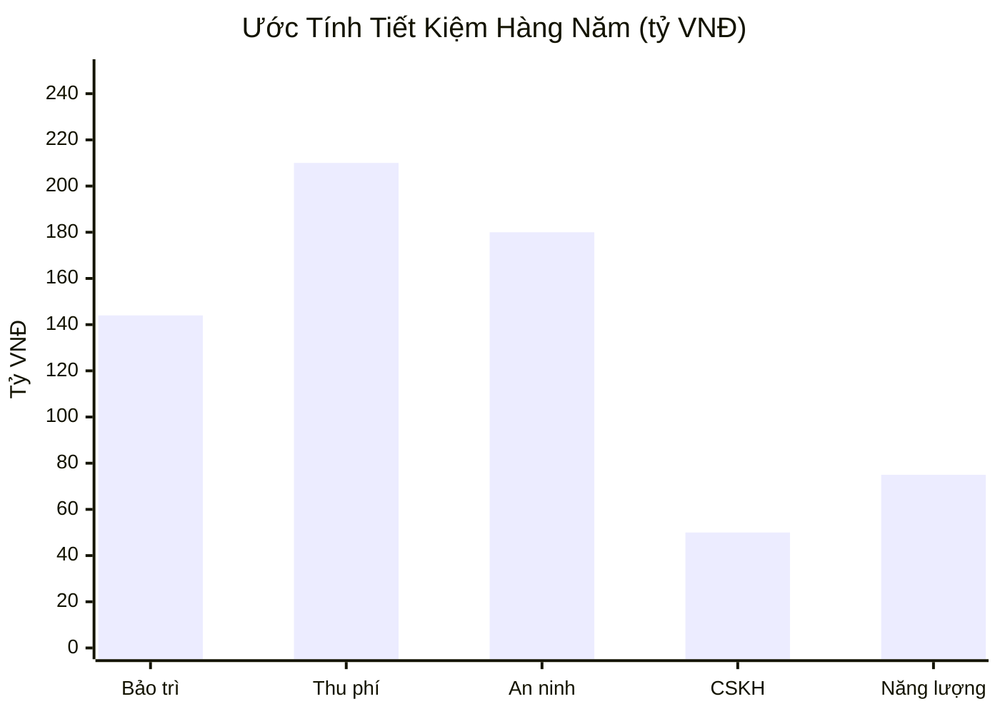
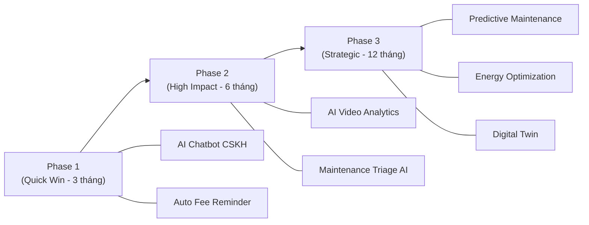

# 🏢 5 Pain Points Vận Hành Vinhomes — Cơ Hội Tối Ưu Bằng AI

> **Bối cảnh:** Vinhomes hiện quản lý **32 khu đô thị**, **~168.000 căn hộ/biệt thự/nhà phố**, phục vụ **~650.000 cư dân** (2025). Quy mô này tạo ra áp lực vận hành khổng lồ, đặc biệt ở các quy trình vẫn còn phụ thuộc nhiều vào con người.

---

## 1. 📋 Xử Lý Yêu Cầu Bảo Trì & Sửa Chữa (Maintenance Request Triage)

### Hiện trạng
- Cư dân gọi hotline / gửi qua app → Nhân viên BQL tiếp nhận → Phân loại thủ công → Liên hệ vendor → Lên lịch → Theo dõi → Xác nhận hoàn thành.
- Mỗi ticket trung bình tốn **~45 phút** nhân sự qua **5 bước giao tiếp** (ghi nhận, liên hệ vendor, xin phê duyệt, lên lịch, follow-up).
- Nhân viên vận hành tốn **8–12 giờ/tuần** chỉ cho việc điều phối bảo trì.

### Ước tính tổn thất
| Chỉ số | Giá trị ước tính |
|---|---|
| Số ticket bảo trì/tháng (toàn hệ thống ~168K căn) | **~25.000–40.000 ticket/tháng** |
| Thời gian xử lý thủ công | ~45 phút/ticket → **~18.750–30.000 giờ nhân công/tháng** |
| Chi phí nhân sự (ước tính 80K VNĐ/giờ) | **~1.5–2.4 tỷ VNĐ/tháng** |
| Tỷ lệ ticket bị trễ/miss follow-up (benchmark ngành) | **15–25%** |
| Chi phí phát sinh do sửa chữa muộn (hư hại lan rộng) | **+30–50%** chi phí sửa gốc |

### Giải pháp AI đề xuất
- **AI Triage Engine:** NLP phân loại tự động mức độ ưu tiên (khẩn cấp/bình thường/định kỳ) từ mô tả cư dân.
- **Smart Routing:** Tự động match ticket → vendor phù hợp nhất (theo skill, khoảng cách, lịch trống, rating).
- **Predictive Maintenance:** Phân tích dữ liệu IoT sensor (thang máy, PCCC, hệ thống nước) để phát hiện sự cố trước khi xảy ra.
- **Tiết kiệm kỳ vọng:** Giảm **60–70%** thời gian xử lý, giảm **30–40%** chi phí vận hành bảo trì.

---

## 2. Thu Phí Dịch Vụ & Quản Lý Công Nợ (Fee Collection & Receivables)

### Hiện trạng
- Phí quản lý, phí dịch vụ, quỹ bảo trì được thu hàng tháng/quý từ ~168.000 hộ dân.
- Nhiều hộ dân trì hoãn thanh toán → nhân sự BQL phải gọi điện nhắc, gửi thông báo giấy, lên danh sách nợ.
- Đối soát công nợ giữa nhiều hệ thống (ngân hàng, ví điện tử, tiền mặt) chủ yếu thủ công hoặc bán tự động.

### Ước tính tổn thất
| Chỉ số | Giá trị ước tính |
|---|---|
| Tỷ lệ nợ quá hạn phí dịch vụ (benchmark BĐS VN) | **8–15%** hộ dân/tháng |
| Số hộ nợ quá hạn | **~13.000–25.000 hộ/tháng** |
| FTE dành cho nhắc nợ & đối soát (ước tính) | **~150–250 nhân sự full-time** toàn hệ thống |
| Thất thoát doanh thu do nợ khó đòi | **~2–5%** tổng doanh thu phí dịch vụ/năm |
| Giá trị thất thoát (phí dịch vụ ~3–5 triệu/căn/tháng) | **~100–420 tỷ VNĐ/năm** |

### Giải pháp AI đề xuất
- **AI Dunning System:** Tự động phân nhóm cư dân theo hành vi thanh toán → gửi nhắc nhở cá nhân hóa qua kênh phù hợp (app push, SMS, Zalo, email) vào thời điểm tối ưu.
- **Churn/Default Prediction:** Dự đoán hộ dân có nguy cơ nợ xấu để can thiệp sớm.
- **Auto Reconciliation:** AI đối soát tự động giao dịch từ đa kênh thanh toán.
- **Tiết kiệm kỳ vọng:** Giảm **40–60%** FTE nhắc nợ, giảm **30–50%** nợ quá hạn.

---

## 3. Giám Sát An Ninh & Xử Lý Sự Cố (Security Monitoring & Incident Response)

### Hiện trạng
- Hệ thống camera khổng lồ (ước tính **hàng chục nghìn camera** trên 32 khu đô thị).
- Nhân sự bảo vệ giám sát bằng mắt → tỷ lệ phát hiện sự cố qua camera thấp (human attention span giảm mạnh sau **20 phút** giám sát liên tục).
- Kiểm soát ra/vào: kiểm tra thẻ cư dân, đăng ký khách thủ công, kiểm tra biển số xe bằng mắt.
- Xử lý sự cố: ghi chép sổ sách, báo cáo bằng giấy/Excel, chậm truy xuất lịch sử.

### Ước tính tổn thất
| Chỉ số | Giá trị ước tính |
|---|---|
| Số nhân sự an ninh toàn hệ thống (3 ca/ngày) | **~3.000–5.000 người** |
| Chi phí nhân sự an ninh/năm (~8–10 triệu/người/tháng) | **~290–600 tỷ VNĐ/năm** |
| Tỷ lệ sự cố bị bỏ sót do giám sát bằng mắt | **~60–80%** sự cố nhỏ không được phát hiện kịp thời |
| Thời gian phản ứng trung bình (manual) | **8–15 phút** |
| Thiệt hại do trộm cắp, phá hoại (benchmark ngành) | **~0.1–0.3%** giá trị tài sản quản lý/năm |

### Giải pháp AI đề xuất
- **AI Video Analytics:** Phát hiện tự động hành vi bất thường (xâm nhập, đánh nhau, cháy nổ, vật thể khả nghi) real-time.
- **License Plate Recognition (LPR) + Face Recognition:** Tự động kiểm soát ra/vào, loại bỏ barrier thủ công.
- **Anomaly Detection:** AI phát hiện pattern bất thường (xe lạ xuất hiện nhiều lần, người lảng vảng khu vực nhạy cảm).
- **Tiết kiệm kỳ vọng:** Giảm **30–40%** nhân sự giám sát, giảm thời gian phản ứng xuống **< 1 phút**, tăng tỷ lệ phát hiện sự cố **+300–400%**.

---

## 4. Chăm Sóc Cư Dân & Xử Lý Khiếu Nại (Resident Support & Complaint Handling)

### Hiện trạng
- Cư dân liên hệ BQL qua hotline, email, app, trực tiếp quầy lễ tân → nhân viên tiếp nhận thủ công.
- Các câu hỏi lặp lại chiếm tỷ lệ cao: giờ mở cửa tiện ích, cách đóng phí, quy trình đăng ký sửa chữa, thông tin quy hoạch...
- Khiếu nại phức tạp (tiếng ồn, chất lượng xây dựng, hàng xóm) cần leo thang nhiều cấp, dễ bị thất lạc.
- Thời gian phản hồi trung bình: **24–72 giờ** cho yêu cầu không khẩn cấp.

### Ước tính tổn thất
| Chỉ số | Giá trị ước tính |
|---|---|
| Số cuộc gọi/tin nhắn/tháng (toàn hệ thống) | **~80.000–150.000 lượt/tháng** |
| Tỷ lệ câu hỏi lặp lại (FAQ-able) | **~50–65%** |
| FTE cho CSKH (call center + lễ tân) | **~400–700 nhân sự** |
| Chi phí nhân sự CSKH/năm | **~38–84 tỷ VNĐ/năm** |
| Tỷ lệ cư dân không hài lòng vì phản hồi chậm | **~20–35%** |
| Tác động gián tiếp: giảm giá trị thương hiệu, giảm tỷ lệ mua lại | Khó đo lường, ước tính **-3–5%** tỷ lệ referral |

### Giải pháp AI đề xuất
- **AI Chatbot / Voicebot đa ngữ:** Xử lý tự động 50–65% câu hỏi FAQ, 24/7, tiếng Việt + tiếng Anh + tiếng Hàn/Nhật (cho cư dân quốc tế).
- **Smart Escalation:** AI phân loại mức độ nghiêm trọng của khiếu nại → tự động leo thang đúng bộ phận với đầy đủ context.
- **Sentiment Analysis:** Phân tích cảm xúc cư dân từ feedback, review, tin nhắn → cảnh báo sớm "hot zone" tiềm ẩn bất ổn.
- **Tiết kiệm kỳ vọng:** Giảm **50–60%** FTE CSKH, giảm thời gian phản hồi xuống **< 5 phút** cho FAQ, tăng NPS **+15–25 điểm**.

---

## 5. Quản Lý Năng Lượng & Hạ Tầng Kỹ Thuật (Energy & Facility Management)

### Hiện trạng
- Quản lý hệ thống điện, nước, thang máy, PCCC, HVAC (điều hòa trung tâm) chủ yếu theo lịch cố định (preventive maintenance) hoặc reactive (hỏng thì sửa).
- Giám sát tiêu thụ năng lượng khu vực chung bằng báo cáo Excel tháng → chậm phát hiện bất thường.
- Lịch bảo trì thiết bị (thang máy, máy phát điện, hệ thống nước) dựa trên khuyến nghị nhà sản xuất, không tối ưu theo tình trạng thực tế.

### Ước tính tổn thất
| Chỉ số | Giá trị ước tính |
|---|---|
| Chi phí năng lượng khu vực chung/năm (32 KĐT) | **~200–400 tỷ VNĐ/năm** |
| % năng lượng lãng phí (benchmark tòa nhà VN) | **~15–30%** |
| Giá trị năng lượng lãng phí | **~30–120 tỷ VNĐ/năm** |
| Chi phí sửa chữa khẩn cấp vs. bảo trì dự phòng | Gấp **3–5x** chi phí bảo trì định kỳ |
| Số sự cố kỹ thuật nghiêm trọng/năm (thang máy, PCCC) | **~200–500 sự cố/năm** toàn hệ thống |
| Downtime do sự cố (ảnh hưởng cư dân) | **~2.000–5.000 giờ downtime/năm** |

### Giải pháp AI đề xuất
- **AI Energy Optimization:** Phân tích pattern tiêu thụ điện/nước → tự động điều chỉnh chiếu sáng, HVAC, bơm nước theo thời gian thực và dự báo thời tiết.
- **Predictive Maintenance:** ML models phân tích dữ liệu vibration, nhiệt độ, dòng điện từ IoT sensor → dự báo hỏng hóc trước **2–4 tuần**.
- **Digital Twin:** Mô hình hóa hạ tầng kỹ thuật toàn khu đô thị → tối ưu vận hành, mô phỏng kịch bản sự cố.
- **Tiết kiệm kỳ vọng:** Giảm **15–25%** chi phí năng lượng, giảm **40–60%** sự cố ngoài kế hoạch, kéo dài **20–30%** tuổi thọ thiết bị.

---

## Tổng Hợp Tác Động & ROI Tiềm Năng

| # | Pain Point | Tổn thất ước tính/năm | Tiết kiệm AI kỳ vọng | ROI Year 1 |
|---|---|---|---|---|
| 1 | Bảo trì & Sửa chữa | ~18–29 tỷ VNĐ | ~11–20 tỷ VNĐ | 3–5x |
| 2 | Thu phí & Công nợ | ~100–420 tỷ VNĐ | ~30–210 tỷ VNĐ | 5–10x |
| 3 | An ninh & Giám sát | ~290–600 tỷ VNĐ | ~87–240 tỷ VNĐ | 2–4x |
| 4 | CSKH & Khiếu nại | ~38–84 tỷ VNĐ | ~19–50 tỷ VNĐ | 4–8x |
| 5 | Năng lượng & Hạ tầng | ~30–120 tỷ VNĐ | ~5–30 tỷ VNĐ | 2–3x |
| | **TỔNG** | **~476–1.253 tỷ VNĐ** | **~152–550 tỷ VNĐ** | **3–6x** |

> [!IMPORTANT]
> Các con số trên là **ước tính** dựa trên quy mô công khai của Vinhomes (~168K căn, ~650K cư dân, 32 KĐT) kết hợp benchmark ngành quản lý BĐS quốc tế và Việt Nam. Con số thực tế cần được validate bằng dữ liệu nội bộ từ Vinhomes/VMSF.

---

## 🎯 Khuyến Nghị Ưu Tiên Triển Khai

1. **Phase 1 — Quick Win (0–3 tháng):** AI Chatbot + Auto Dunning → ROI nhanh, dễ đo lường, ít rủi ro.
2. **Phase 2 — High Impact (3–6 tháng):** AI Video Analytics + Maintenance Triage → tác động lớn đến chi phí nhân sự.
3. **Phase 3 — Strategic (6–12 tháng):** Predictive Maintenance + Energy Optimization + Digital Twin → đòi hỏi IoT infrastructure, ROI dài hạn.

> [!TIP]
> **Bước tiếp theo:** Chọn **1 khu đô thị pilot** (khuyến nghị: Vinhomes Smart City hoặc Vinhomes Grand Park — quy mô lớn, hạ tầng IoT sẵn có) để validate các giả thiết trước khi scale toàn hệ thống.
